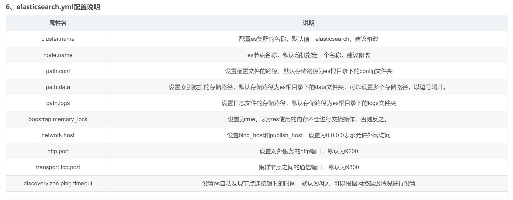

# 01 下载各个组件
## elasticsearch下载地址
https://www.elastic.co/downloads/past-releases/elasticsearch-7-17-3
## 可视化软件kibana下载地址
https://artifacts.elastic.co/downloads/kibana/kibana-7.17.3-linux-x86_64.tar.gz
## 中文处理
elasticsearch-analysis-ik-7.17.3.zip

# 02 创建非root用户
``` bash
sudo useradd -m app  
sudo passwd app  
sudo usermod -s /bin/bash app
``` 

使用 root 权限执行以下命令，改变指定abc用户目录及其内所有子文件的所属主与所属组</br>
``` bash
chown abc:abc -R /home/abc
```

# 03 修改系统配置，满足ES的必须条件
修改limits配置文件进行系统配置</br>
``` bash
vim /etc/security/limits.conf
在limits.conf配置文件的最下面新增以下4行代码
nofile 65536
memlock unlimited
esuser hard nofile 65536
esuser soft nofile 65536
``` 

# 04 修改与使用ES相关的系统配置，再启动ES
修改相关的系统配置</br>
sysctl -w vm.max_map_count=262114
关于报错：[2]: max virtual memory areas vm.max_map_count [65530] is too low, increase to at least [262144]
解决办法：
``` bash
vim /etc/sysctl.conf
添加：
vm.max_map_count=262144
保存后，执行：
sysctl -p
重新启动，成功。
```

vim config/elasticsearch.yml
在当前配置文件的最下面添加以下配置</br>
``` bash
cluster.name: elasticsearch
node.name: es-node0
http.port = 9200
network.host: 0.0.0.0
cluster.initial_master_node: ["es-node0"]
```
启动elasticsearch</br>
``` bash
./bin/elasticsearch
``` 

# 05 判断es是否启动成功
浏览器输入 http://ip:9200，返回
``````json
{
  "name" : "es-node1",
  "cluster_name" : "my-elasticsearch",
  "cluster_uuid" : "AEHRJfFiTmmSrwTIomdSbg",
  "version" : {
    "number" : "7.13.2",
    "build_flavor" : "default",
    "build_type" : "tar",
    "build_hash" : "4d960a0733be83dd2543ca018aa4ddc42e956800",
    "build_date" : "2021-06-10T21:01:55.251515791Z",
    "build_snapshot" : false,
    "lucene_version" : "8.8.2",
    "minimum_wire_compatibility_version" : "6.8.0",
    "minimum_index_compatibility_version" : "6.0.0-beta1"
  },
  "tagline" : "You Know, for Search"
}
``````

# 05 elasticsearch.yml配置说明


# 06 修改es内存参数
在elasticsearch根目录下的config文件夹中的jvm.options文件，修改两个参数，修改之后重启即可。
最大内存
-Xms4g
最小内存
-Xmx4g

# 07 启停脚本
``` bash
#!/bin/bash

# 定义Elasticsearch的安装路径
ES_HOME=/path/to/elasticsearch

# 检查是否提供了启动或停止的参数
if [ "$#" -ne 1 ]; then
    echo "Usage: $0 {start|stop}"
    exit 1
fi

# 根据提供的参数执行相应的操作
case $1 in
    start)
        echo "Starting Elasticsearch..."
        $ES_HOME/bin/elasticsearch -d # '-d' 参数表示以守护进程的方式运行
        ;;
    stop)
        echo "Stopping Elasticsearch..."
        # Elasticsearch没有提供内置的停止命令，通常需要使用pkill或kill命令
        # 这里使用的是pkill来匹配进程名称
        pkill -f "org.elasticsearch.bootstrap.Elasticsearch"
        ;;
    *)
        echo "Usage: $0 {start|stop}"
        exit 1
        ;;
esac

```

# 09 安装中文分词插件 安装拼音插件
根据安装的es版本进行下载https://github.com/medcl/elasticsearch-analysis-ik/releases

解压zip包unzip elasticsearch-analysis-ik-7.13.2.zip -d elasticsearch-7.13.2/plugins/ik

./bin/elasticsearch-plugin install https://github.com/medcl/elasticsearch-analysis-pinyin/releases/download/v7.17.3/elasticsearch-analysis-pinyin-7.17.3.zip
重启es

# 10 安装图形化界面kibana
修改文件<kibana_home>/config/kibana.yml
``````bash
server.port: 5601
server.host: "0.0.0.0"
elasticsearch.hosts: ["http://localhost:9200"]
``````
启动服务
``````bash
nohup bin/kibana > /dev/null 2>&1 &
``````


https://blog.csdn.net/zx_1305769448/article/details/129427815

https://blog.csdn.net/m0_50287279/article/details/131819482

https://blog.csdn.net/u010080562/article/details/123843540

https://blog.csdn.net/m0_67403272/article/details/126660382