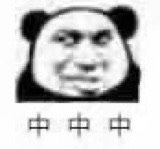
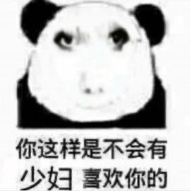
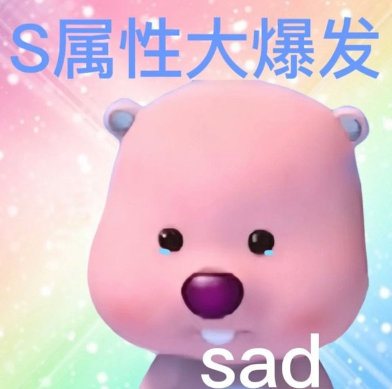
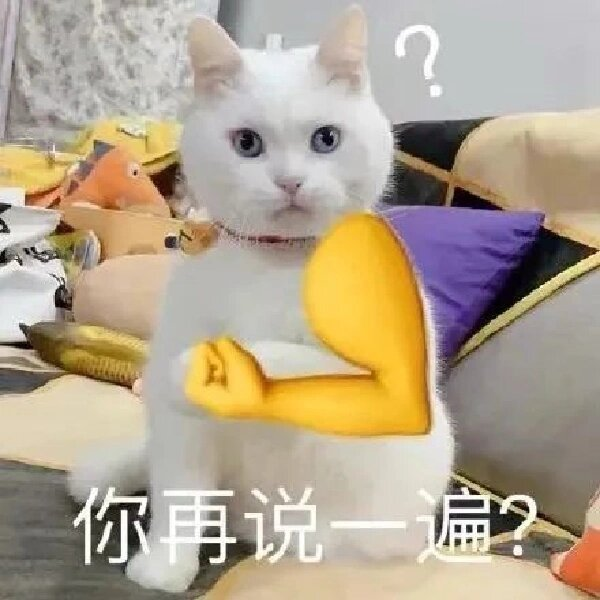

| 图片 | gpt4o | gpt4 | gemini-1.5-pro | gemini-pro-version |
|---|---|---|---|---|
|  | 这张表情包是一张黑白图片，展示了一个以熊猫为主体的卡通形象。图片的上半部分是一个熊猫头，但在熊猫头中间嵌入了一个人类男性的脸。这种组合给人一种滑稽和怪异的感觉。熊猫头的形象是通过黑色的耳朵和白色的脸部背景来表现的，而嵌入的人脸则是相对比较清晰的，有着明显的五官。  在这张表情包的下方，有三行汉字“中中中”。这几个字都是“中”字，排列在一起。单个“中”字在中文中有多种含义，可以表示“中间”、“中国”等，但在这个表情包中，重复三次的“中”字并没有直接的语境提示其确切含义。  综合分析，这张表情包通过将熊猫和人脸的结合，表现出一种滑稽和荒谬的效果。熊猫形象通常带有可爱、无辜的感觉，但加上一个成年男性的脸后，这种反差让人觉得搞笑和不可思议。至于下方的“中中中”，可以理解为一种重复的幽默效果，可能意在表达一种无奈或者调侃的情绪。  总体来说，这张表情包可能用来表达一种戏谑、搞笑的情绪，利用视觉上的强烈对比来引起观看者的注意和笑声。 | 这张表情包的内容相当独特和简洁。主图是一张结合了熊猫头和人脸的图像，呈现了一种颇具幽默感的视觉效果。人脸表情略显严肃，与典型的熊猫表情形成对比，这种组合可能在表达一种幽默或讽刺的意味。图像下方有三个加号（+++），这可能象征着正面增加、积极的提升或是在强调某种程度的增长和扩展。  整体来看，这张表情包可能是用来表达在某种情境下的不满或讽刺态度，例如在讨论时表达对某个意见的强烈支持或讽刺地赞同。通过使用熊猫这一通常被视为可爱和和平的动物形象，与一个稍显严肃的人类面部表情相结合，创造出一种意想不到的幽默或讽刺效果。这种表情包在网络对话中使用时，可能用以轻松地表达某种观点或情绪，同时不完全直接表达，增添了一些思考的空间。 | 这张表情包的主体是一只熊猫头，它的五官经过了扭曲，呈现出一种似笑非笑、略带嘲讽和不屑的表情，眼睛眯起，嘴角上扬，仿佛在看穿一切。下方配有三个“中”字，通常表示“被说中了”“一语中的”等意思。结合熊猫头的表情，这张表情包表达了一种对某件事或某个人已经看透、表示不屑一顾，并且带有强烈的嘲讽意味，仿佛在说“呵，又被我说中了吧”。  |  这是一张熊猫头的表情包，熊猫头眯着眼睛，露出意味深长的笑容，嘴角微微上扬，表情看起来有些欠扁。在图片的下方，有三个“中”字，分别代表“中国”、“中央”、“政府”。  这个表情包可能是在讽刺某些人或事，比如某些官员贪污腐败，或者某些政策不合理。它想表达的情绪可能是愤怒、不满或无奈。 |
|  | 这张表情包是一张黑白图片，展示了一个熊猫的卡通形象。熊猫的脸上嵌入了一张人的脸，不过这张脸的五官并不清晰，整体显得模糊。熊猫的黑耳朵和白色脸部背景依然保留，形成了熊猫的典型外观。  在图片的下方，有一段中文文字：“你这样是不会有少妇喜欢你的”。这句话的意思是，某人（图片中的对象或观众）以这种方式表现是不会受到年轻已婚女性的喜欢。文字内容具有一种责备或者调侃的语气，暗示对方的某种行为或外貌不符合一般的吸引标准。  综合分析，这张表情包通过熊猫和人脸的组合，再加上这句话，表达了一种调侃和批评的情绪。熊猫通常被认为是可爱的动物，但在这里嵌入了一张不清晰的人脸，给人一种滑稽和不协调的感觉。这种反差，加上文字内容，似乎在讽刺某人的外貌或行为举止不受欢迎，无法吸引异性尤其是年轻已婚女性的喜爱。  总的来说，这张表情包通过视觉上的强烈对比和讽刺性的文字，传达出一种幽默、调侃的情绪，旨在引起观者的会心一笑，同时也可能在一定程度上批评或调侃特定对象的行为或形象。 | 这张表情包由一个熊猫头与人的脸部特征结合而成的图像组成，背景为简单的白色。熊猫的黑白色彩与人的面部表情混合，面部表情稍显严肃。在图像下方配有一行中文文字：“你这样是不会有小孩的，小孩是要来的”。这句话是一种常见的幽默说法，用来回应某人的不合适或古怪的行为，暗示这种行为不利于或无助于未来的某些期望（如生育小孩）。这通常不是字面意义上的评论，而是一种风趣的讽刺或忠告。  这张表情包想要表达的情绪是幽默和讽刺。通过将人脸与熊猫相结合，创造出一种不匹配的、略显荒谬的视觉效果，配合文字信息，强化了这一幽默效果。它常用于网络对话中，对他人的某些言行进行风趣的批评或调侃，特别是当对方的行为被视为不切实际或离奇时。这种表情包的使用通常是轻松的，意在以一种幽默的方式传达批评或不满，而不是严肃的指责。 |  这是一张熊猫的表情包，熊猫的头上有一对黑色的耳朵，黑白相间的眼睛，嘴巴是闭着的，表情看起来很严肃。在熊猫的下方有一段文字，文字的内容是“你这样是不是会有点喜欢你的”。这张表情包可能是在表达一种傲娇的情绪，也有可能是在表达一种不开心的情绪。 |  这是一张熊猫头的表情包，熊猫头用一种傲娇的表情斜视着，嘴巴微微张开，露出尖尖的牙齿，好像在嘲笑或蔑视地看着某人。它的手叉在胸前，身体微微前倾，好像在说“你过来呀，我倒要看看你能把我怎样”。文字内容是“你这样是不可能有小姐姐喜欢你的”，这句话加重了熊猫头不屑一顾的语气，突出了它对对方的不屑和嘲讽。这个表情包通常用来表示对某人或某事的嘲讽或蔑视。 |
|  | 这张表情包展示了一个卡通形象和一些文字。图片的背景是一个带有彩虹色彩斑斓的渐变背景，显得十分梦幻和可爱。图片的主体是一个粉红色的卡通动物，具体来说，应该是一个类似于小熊或河狸的形象。这个卡通形象有着圆圆的脸，大大的黑色眼睛，紫色的鼻子和微微露出的小白牙。  这个卡通形象的表情看起来非常伤心，眼睛下方有两行小小的泪水，表明它正在哭泣或非常悲伤。  在图片的上方，有蓝色大字“S属性大爆发”。在图片的下方，有白色小字“sad”。这里的“S属性”一般指的是“抖S”，即施虐倾向的属性。而“大爆发”意味着这种属性突然变得非常强烈。“sad”是英文的“伤心”之意，直接表达了卡通形象的情绪状态。  综合分析，这张表情包通过可爱的卡通形象与伤心的表情，再加上文字的结合，表现出一种反差萌的效果。背景的梦幻色彩与卡通形象的可爱外表，与其伤心的情绪形成了强烈的对比。同时，文字“S属性大爆发”可能是调侃某人在展示出其施虐的一面后，感到意外或后悔，导致了伤心的情绪。这种表情包常用于网络聊天中，用来表达一种夸张的情绪反应，或者调侃某人突然表现出“抖S”特质后的反应，具有幽默和讽刺的效果。 | 这张表情包中的主体是一个卡通化的粉色熊猫形象，背景是一片色彩斑斓、星光闪耀的虚拟空间，增添了一种梦幻感。熊猫的眼角带有蓝色的泪滴，面部表情看起来有些悲伤。在图片的上方，用大号字体写着“S腿性大傻熊”，而在图像的底部则简单地标注了英文单词“sad”。  从这张表情包可以看出，它主要表达的是一种悲伤或失望的情绪。熊猫的泪滴和“sad”字样都明确传达了这一情感。同时，“S腿性大傻熊”这句话可能是一种网络流行语或特定语境下的戏称，用来描绘某种具有“傻大”特质的无辜或笨拙的形象。整体而言，这张表情包可能用于网络对话中，以幽默和夸张的方式表达悲伤或失望的情绪，同时带有一定的可爱和戏谑元素，使得表达更加轻松和风趣。 |  这是一张表情包，图片中有一只卡通小动物，它看起来很沮丧，眼睛里含着泪水，嘴巴紧闭着，表情看起来很不高兴。它的头上有一个蓝色的文字“S属性大爆发”，旁边有一个紫色的小字“sad”。这张表情包可能是用来表达一个人感到非常沮丧或悲伤的心情。 |  这是一张表情包，图片中是一个悲伤的小仓鼠，它哭着，眼睛里含着泪水，嘴巴微微张开，露出两颗小牙齿。它的头上有一个蓝色的文字“S属性大爆发”，旁边有一个英文单词“sad”，表示悲伤。小仓鼠的周围是彩虹色的背景，象征着五彩缤纷的心情。这张表情包可以用来表达愤怒、悲伤或沮丧等情绪。 |
|  | 这张表情包展示了一只白色的猫咪，猫咪有着异色瞳，一只眼睛是蓝色，另一只眼睛是黄色。猫咪坐在一个居家环境中，背景里有一些毛绒玩具和靠垫。猫咪的表情显得严肃而疑惑，它的头顶上有一个白色的问号，表示困惑或者不解。  在猫咪的前方，特别突兀地添加了一个黄色的肌肉手臂的表情符号，这个手臂弯曲，显示出强壮的肌肉，代表力量和挑战的意味。在图片的底部，有一行白色的中文文字：“你再说一遍？”这句话的语气带有挑衅和威胁的意味，似乎是在质问对方，带有一种不服输或者准备反击的态度。  综合分析，这张表情包通过猫咪严肃的表情和困惑的问号，再加上强壮手臂的表情符号和挑衅性的文字，表达了一种戏谑和搞笑的情绪。这张图片可能用来在网络聊天中调侃或回应他人，当对方说了一些让人不满或不可置信的话时，发送这张表情包以表示不满、质疑甚至准备“反击”的态度。整体上，这张表情包通过视觉和文字的结合，传递出一种强烈的对比和幽默效果。 | 这张表情包显示了一只白色的猫，面部表情呈现出一种惊讶的神态，眼睛大而明亮。猫身上被P图加上了一个卡通的黄色手臂，手臂肌肉发达，姿势像是在做强调的动作。在图片的上方，有一个问号，表示疑问或困惑。图片底部的文字“你再说一遍？”用来表达一种不相信或要求对方重复刚才所说内容的情绪。  这张表情包的整体风格带有明显的幽默感，通过给猫加上不符合其本身特征的肌肉手臂，产生了一种视觉上的滑稽和突兀感。文字和表情的结合，通常用于对话中表达对某个难以置信或令人惊讶的陈述的反应。这可以用来表达轻微的嘲讽或是真正的要求对方澄清前言。使用场景可能是在社交媒体或聊天中，对朋友或他人的突出言论作出幽默而夸张的反应。 | 一只白色猫咪坐在地上，眼神严肃，微微抬头，仿佛在看什么人，头顶上是一个黑色的问号。猫咪的脖子上戴着红色的项圈，胸前P了一个握紧拳头的强壮手臂。图片下方配字“你再说一遍？”。这张表情包表达了这只猫咪听到对方的话后不高兴了，想要威胁对方，有点“你再说一遍试试”的挑衅意味，语气比较凶狠，带有一定的威胁意味，可以用来表达自己对对方的不满和警告。  |  这是一张以一只白色猫咪为主角的表情包。猫咪的表情严肃，右前臂肌肉线条明显，似乎在展示自己的肌肉。右上角有一个问号，下方有一句文字“你再说一遍试试？”，这句话的语气中包含着愤怒和警告的意味。整张表情包透露着一种“你再说一遍我就揍你”的含义，可以用来表达愤怒、不满或警告对方不要再说某些话。 |
|  | 这张表情包只有简单的黑白文字，没有人物、动漫或卡通图像。图片的背景是白色的，上面用黑色字体写了两行字：  “谢谢 祝你生八个儿子”  第一行“谢谢”表示感谢，语气显得非常礼貌和普通。然而，第二行的“祝你生八个儿子”则带有明显的调侃和讽刺意味。在中文网络文化中，“生八个儿子”是一种夸张的表达，暗示让对方在家庭方面承担巨大压力和负担，因为在传统观念里，养育八个孩子尤其是八个儿子，意味着需要非常多的精力和财力。  这种表情包常用于网络交流中，当某人对你说了一些让你感到不满或者无奈的话时，回复这样一张表情包既可以表达你的不满，又带有幽默的成分，缓解可能的冲突。通过夸张的祝福方式，这张表情包传达出一种“善意的诅咒”或“假装礼貌”的幽默感。 | 这张表情包仅包含简单的文字内容，没有任何背景或图像元素。文字为：“嘿嘿，如果你生个八个儿子”。这句话是一种幽默表达，常见于网络对话，用来暗示某种极不可能或夸张的情况发生的前提，通常隐含后续内容会更加荒谬或幽默。  通过这种文字表达，表情包很可能是用来引发笑声或是在轻松的对话中引出一个荒诞的假设情景，增加对话的趣味性。这种表情包通常不涉及直接的情绪表达，而是依靠接收者对这种幽默方式的理解来产生效果。使用这样的表情包，发送者可能在寻求以一种幽默和不严肃的方式与他人交流，增添对话的幽默氛围。 | 这张表情包只有简单的文字，上面写着“谢谢 祝你生八个儿子”。这句话本身带有调侃和戏谑的意味，通常在网络上被用来表达对他人言语或行为的不满、反讽或诅咒。它利用了传统文化中“多子多福”观念的反面，用夸张的“八个儿子”来制造幽默效果，实际上传达的是一种“让你也感受一下被烦扰”的幸灾乐祸情绪。  |  这张图的文字是：“谢谢，祝你生八个孩子”。图片中没有其他的元素，只有文字。这张图可能是为了表达对别人的感谢，同时祝愿对方生许多孩子。在中国文化中，生孩子是件值得祝福的事情，尤其是多子多福的观念根深蒂固，因此这张图可能是为了表达对别人的美好祝愿。 |